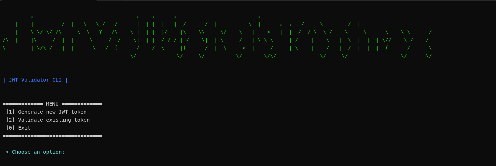

# 🛡️ JWT Validator CLI



A simple **C# console application** that allows you to **generate and
validate JWT tokens** using configuration values from an
`appsettings.json` file.\
This tool is useful for developers who want to test JWTs locally and
understand how claims and validation work.

------------------------------------------------------------------------

## 🚀 Features

-   **Interactive Mode**: User-friendly menu-driven interface for JWT operations
-   **Command Line Mode**: Generate and validate tokens via command-line flags
-   **Dynamic Claims**: Add custom claims interactively with real-time validation
-   **Multiple Signature Algorithms**: Support for HS256, HS512, and RS256 algorithms
-   **Generate JWT tokens** with custom claims and subjects
-   **Validate and inspect** existing JWT tokens with detailed claim information
-   **Configurable settings**: secret, issuer, audience, expiration time, and algorithm
-   **Visual feedback** with console animations and colored output
-   **File output**: Save generated tokens to files
-   **Export/Import system**: Export and import tokens, templates, and settings
-   **Claims templates**: Create reusable claim templates for common scenarios
-   **Template-based generation**: Generate tokens from predefined templates
-   **Verbose mode**: Detailed logging and information display
-   **Fully self-contained CLI app**

------------------------------------------------------------------------

## ⚙️ Configuration

The application reads settings from the `appsettings.json` file:

``` json
{
  "JwtSettings": {
    "Secret": "your-secret-key-here",
    "Issuer": "Api",
    "Audience": "Api",
    "ExpiryMinutes": 60,
    "Algorithm": "HS256",
    "PrivateKeyPath": "private.pem",
    "PublicKeyPath": "public.pem"
  }
}
```

  -----------------------------------------------------------------------
  Field                    Description
  ------------------------ ----------------------------------------------
  **Secret**               The secret key used to sign and validate JWT
                           tokens (Base64 or string). Required for HS256/HS512.

  **Issuer**               The issuer of the token.

  **Audience**             The intended audience of the token.

  **ExpiryMinutes**        How long the token remains valid (in minutes).

  **Algorithm**            Signature algorithm: HS256, HS512, or RS256.

  **PrivateKeyPath**       Path to RSA private key file (required for RS256).

  **PublicKeyPath**        Path to RSA public key file (required for RS256).
  -----------------------------------------------------------------------

------------------------------------------------------------------------

## 🧩 How to Run

1.  **Clone or download** this project.\

2.  Open a terminal in the project folder.\

3.  Make sure you have the **.NET SDK** installed.\
    You can verify it with:

    ``` bash
    dotnet --version
    ```

4.  Build and run the project:

    ``` bash
    dotnet run
    ```

------------------------------------------------------------------------

## 🕹️ Usage

The JWT Validator CLI supports two modes of operation:

### 📱 Interactive Mode

When you run the program without arguments, you'll see an interactive menu:

``` bash
dotnet run
```

    ============= MENU =============
     [1] Generate new JWT token
     [2] Validate existing token
     [3] Generate token from template
     [4] Manage claims templates
     [0] Exit
    ================================

#### 🔑 Generate a Token with Dynamic Claims

Choose option `1` and enter a subject (e.g., an email or user ID). You can then add custom claims dynamically using the interactive interface:

```
📝 Add custom claims (optional):
Enter claims in key=value format, one per line.
Press Enter on empty line to finish.
Examples: role=admin, department=IT, permissions=read,write

> role=admin
  ✅ Added: role = admin
> department=IT
  ✅ Added: department = IT
> permissions=read,write,delete
  ✅ Added: permissions = read,write,delete
> [empty line to finish]

📋 Claims to be included (3):
  • role: admin
  • department: IT
  • permissions: read,write,delete
```

#### 🧾 Validate a Token

Choose option `2` and paste an existing token.\
The app will validate it and display whether it's valid, along with its claims.

#### 📝 Generate Token from Template

Choose option `3` to generate tokens using predefined templates. You can select from existing templates and optionally add extra claims.

#### ⚙️ Manage Claims Templates

Choose option `4` to create, list, and view claims templates for reusable claim patterns.

### 💻 Command Line Mode

For automation and scripting, use command-line flags:

#### Generate Token

``` bash
# Basic token generation
dotnet run -- generate --subject "user@example.com"

# With custom claims
dotnet run -- generate --subject "admin@example.com" --claims '{"role":"admin","permissions":"read,write"}'

# Save to file
dotnet run -- generate --subject "user@example.com" --output "token.txt"

# Verbose output
dotnet run -- generate --subject "user@example.com" --verbose
```

#### Validate Token

``` bash
# Basic validation
dotnet run -- validate --token "your-jwt-token-here"

# Pretty print claims
dotnet run -- validate --token "your-jwt-token-here" --pretty

# Verbose validation
dotnet run -- validate --token "your-jwt-token-here" --verbose --pretty
```

#### Export/Import Commands

``` bash
# Export tokens, templates, and settings
dotnet run -- export --include-tokens --include-settings --verbose

# Export only tokens
dotnet run -- export --include-tokens --export-file "my-tokens.json"

# Import from file
dotnet run -- import --import-file "exports/jwt_export_20251007_000029.json"

# Create claims template
dotnet run -- create-template --template-name "admin-user" --template-description "Admin user template"

# List generated tokens
dotnet run -- list --type tokens

# List claims templates
dotnet run -- list --type templates

# List export files
dotnet run -- list --type exports
```

#### Command Options

| Option | Short | Description |
|--------|-------|-------------|
| `--subject` | `-s` | Subject for the JWT token (e.g., email or user ID) |
| `--claims` | `-c` | Additional claims in JSON format |
| `--token` | `-t` | JWT token to validate |
| `--output` | `-o` | Output file path to save the generated token |
| `--verbose` | `-v` | Enable verbose output |
| `--pretty` | `-p` | Pretty print validation results |
| `--config` | `-f` | Path to configuration file (default: appsettings.json) |
| `--export-file` | `-e` | File path for export |
| `--import-file` | `-i` | File path for import |
| `--include-tokens` | | Include generated tokens in export |
| `--include-templates` | | Include claims templates in export |
| `--include-settings` | | Include JWT settings in export |
| `--template-name` | `-n` | Name for the claims template |
| `--template-description` | `-d` | Description for the claims template |

#### Help

``` bash
# Show general help
dotnet run -- --help

# Show command-specific help
dotnet run -- generate --help
dotnet run -- validate --help
dotnet run -- export --help
dotnet run -- import --help
dotnet run -- create-template --help
dotnet run -- list --help
```

------------------------------------------------------------------------

## 📤 Export/Import System

The JWT Validator includes a comprehensive export/import system for managing tokens, templates, and settings.

### Export Features

- **Token Export**: Save generated tokens with metadata (subject, claims, generation time)
- **Template Export**: Export reusable claims templates
- **Settings Export**: Export JWT configuration settings
- **Selective Export**: Choose what to include in exports
- **JSON Format**: Structured JSON format with versioning

### Import Features

- **Data Recovery**: Restore previously exported data
- **Template Import**: Import claims templates for reuse
- **Validation**: Validate import files before processing
- **Error Handling**: Detailed error reporting for failed imports

### Claims Templates

Create reusable templates for common claim patterns:

``` bash
# Create a template interactively
dotnet run -- create-template

# Create with parameters
dotnet run -- create-template --template-name "admin" --template-description "Admin user template"
```

### Export File Structure

``` json
{
  "version": "1.0",
  "exportDate": "2025-10-06T23:00:29.8981111Z",
  "jwtSettings": {
    "Secret": "...",
    "Issuer": "Api",
    "Audience": "Api",
    "ExpiryMinutes": 60,
    "Algorithm": "HS256"
  },
  "tokens": [
    {
      "subject": "user@example.com",
      "claims": {"role": "user"},
      "token": "eyJhbGciOiJIUzI1NiIsInR5cCI6IkpXVCJ9...",
      "generatedAt": "2025-10-06T23:00:29.8981111Z"
    }
  ],
  "claimsTemplates": [
    {
      "name": "admin-user",
      "description": "Admin user template",
      "claims": {"role": "admin", "permissions": "read,write,delete"},
      "createdAt": "2025-10-06T23:00:29.8981111Z"
    }
  ]
}
```

------------------------------------------------------------------------

## 🔐 Supported Algorithms

The JWT Validator supports multiple signature algorithms:

### HMAC Algorithms
- **HS256**: HMAC with SHA-256 (default)
- **HS512**: HMAC with SHA-512

For HMAC algorithms, configure the `Secret` in your `appsettings.json`.

### RSA Algorithm
- **RS256**: RSA with SHA-256

For RS256, you need to provide RSA key files:
1. Create RSA key pair:
   ``` bash
   # Generate private key
   openssl genrsa -out private.pem 2048
   
   # Generate public key
   openssl rsa -in private.pem -pubout -out public.pem
   ```

2. Update `appsettings.json`:
   ``` json
   {
     "JwtSettings": {
       "Algorithm": "RS256",
       "PrivateKeyPath": "private.pem",
       "PublicKeyPath": "public.pem",
       "Issuer": "Api",
       "Audience": "Api",
       "ExpiryMinutes": 60
     }
   }
   ```

------------------------------------------------------------------------

## 🧱 Project Structure

    .
    ├── Program.cs              # Main application with CLI and interactive modes
    ├── JwtService.cs           # JWT generation and validation logic
    ├── CommandLineModels.cs    # Command-line argument definitions
    ├── ExportImportModels.cs   # Export/import data models
    ├── ExportImportService.cs  # Export/import functionality
    ├── appsettings.json        # Configuration file
    ├── exports/                # Directory for export files
    └── README.md

------------------------------------------------------------------------

## 📦 Dependencies

-   `Microsoft.Extensions.Configuration` - Configuration management
-   `Microsoft.Extensions.Configuration.Json` - JSON configuration provider
-   `Microsoft.Extensions.Configuration.Binder` - Configuration binding
-   `Microsoft.Extensions.Configuration.EnvironmentVariables` - Environment variables support
-   `Microsoft.IdentityModel.Tokens` - JWT token handling
-   `System.IdentityModel.Tokens.Jwt` - JWT token creation and validation
-   `System.CommandLine` - Command-line argument parsing

Install them using NuGet if needed:

``` bash
dotnet add package Microsoft.Extensions.Configuration
dotnet add package Microsoft.Extensions.Configuration.Json
dotnet add package Microsoft.Extensions.Configuration.Binder
dotnet add package Microsoft.Extensions.Configuration.EnvironmentVariables
dotnet add package Microsoft.IdentityModel.Tokens
dotnet add package System.IdentityModel.Tokens.Jwt
dotnet add package System.CommandLine
```

------------------------------------------------------------------------

## 🔧 Dynamic Claims Feature

The JWT Validator now supports **dynamic claims addition** in interactive mode, allowing you to add custom claims on-the-fly without modifying code or configuration files.

### 🎆 Key Features

- **Real-time Validation**: Input validation with immediate feedback
- **Visual Feedback**: Color-coded responses with emojis for better UX
- **Flexible Input**: Simple `key=value` format for claim entry
- **Template Integration**: Use predefined templates or create new ones
- **File Export**: Option to save generated tokens to files
- **History Tracking**: All generated tokens are automatically saved

### 📝 Interactive Workflow

1. **Start Interactive Mode**: `dotnet run`
2. **Select Option 1**: Generate new JWT token
3. **Enter Subject**: Provide user identifier (email, ID, etc.)
4. **Add Claims Dynamically**:
   - Enter claims in `key=value` format
   - Get real-time validation feedback
   - See summary before token generation
5. **Generate Token**: Token created with all custom claims
6. **Save Option**: Choose to save token to file

### 📊 Template Management

Create reusable claim templates for common scenarios:

- **Admin Users**: `role=admin`, `permissions=read,write,delete`
- **Regular Users**: `role=user`, `department=IT`
- **API Keys**: `scope=api`, `rate_limit=1000`
- **Custom Scenarios**: Any combination of claims

### 🔍 Validation Features

- **Format Validation**: Ensures `key=value` format
- **Empty Value Check**: Prevents empty keys or values
- **Duplicate Handling**: Overwrites duplicate keys
- **Visual Confirmation**: Shows added claims with checkmarks

------------------------------------------------------------------------

## 📝 Examples

### Example 1: Generate Token with HS256

``` bash
dotnet run -- generate --subject "john.doe@example.com" --verbose
```

Output:
```
Loading configuration from: appsettings.json
Subject: john.doe@example.com
Generating token...
Token generated successfully:
eyJhbGciOiJIUzI1NiIsInR5cCI6IkpXVCJ9.eyJzdWIiOiJqb2huLmRvZUBleGFtcGxlLmNvbSIs...
```

### Example 2: Validate Token with Pretty Print

``` bash
dotnet run -- validate --token "eyJhbGciOiJIUzI1NiIsInR5cCI6IkpXVCJ9..." --pretty --verbose
```

Output:
```
Loading configuration from: appsettings.json
Validating token...
✅ Token is valid!

📋 Claims:
--------------------------------------------------
http://schemas.xmlsoap.org/ws/2005/05/identity/claims/nameidentifier: john.doe@example.com
jti: 3deae1ec-20a8-48bb-9669-340d68ecafda
iat: 1759791119
nbf: 1759791119
exp: 1759794719
iss: Api
aud: Api
--------------------------------------------------
```

### Example 3: Generate Token with Custom Claims

``` bash
dotnet run -- generate --subject "admin@example.com" --claims '{"role":"admin","department":"IT","permissions":"read,write,delete"}' --output "admin-token.txt"
```

### Example 4: Batch Token Generation

``` bash
# Generate multiple tokens for testing
dotnet run -- generate --subject "user1@example.com" --output "user1-token.txt"
dotnet run -- generate --subject "user2@example.com" --output "user2-token.txt"
dotnet run -- generate --subject "admin@example.com" --claims '{"role":"admin"}' --output "admin-token.txt"
```

### Example 5: Export/Import Workflow

``` bash
# Generate some tokens
dotnet run -- generate --subject "user@example.com" --claims '{"role":"user","department":"IT"}'
dotnet run -- generate --subject "admin@example.com" --claims '{"role":"admin","permissions":"read,write,delete"}'

# Create a claims template
dotnet run -- create-template --template-name "developer" --template-description "Developer template"

# Export everything
dotnet run -- export --include-tokens --include-templates --include-settings --verbose

# List what we have
dotnet run -- list --type tokens
dotnet run -- list --type templates
dotnet run -- list --type exports

# Import from a specific file
dotnet run -- import --import-file "exports/jwt_export_20251007_000029.json" --verbose
```

### Example 6: Interactive Dynamic Claims

``` bash
# Run interactive mode
dotnet run

# Select option 1 for token generation
# Enter subject: admin@company.com
# Add claims interactively:
# > role=admin
# > department=IT
# > permissions=read,write,delete
# > level=5
# > [empty line to finish]

# Token will be generated with all custom claims
# Option to save to file will be presented
```

### Example 7: Claims Template Usage

``` bash
# Create a template for admin users
dotnet run -- create-template --template-name "admin-user" --template-description "Standard admin user"

# Enter claims interactively:
# > role=admin
# > permissions=read,write,delete
# > department=IT
# > [empty line to finish]

# List templates to verify
dotnet run -- list --type templates

# Export templates for backup
dotnet run -- export --include-templates --export-file "admin-templates.json"
```

------------------------------------------------------------------------

## 🧠 Author

Created by **Felipe** 💻\
A simple yet educational project for learning and testing JWT
authentication logic in C#.

------------------------------------------------------------------------

## 📜 License

This project is licensed under the **MIT License**.
